# Computer Vision Lab 1 - Basic image operations
Lorin Speybrouck

## Exercise 1
### Question 1
> What do the dimensions of the image array represent?

They represent the width and hight of the image.

### Assignment 1
> Crop the image so it becomes square by chopping off the a part on the right side.

```python
image_path = 'img/clouds.jpg'
image = cv2.imread(image_path)

height, width, _ = image.shape
cropped_image = image[0:height, 0:height]

cv2.imwrite('out/assignement1.jpg', cropped_image)
```

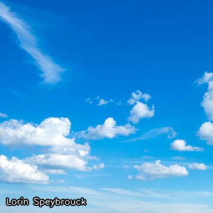

### Assignment 2
> Discolor the image by reducing the intensity of the red value of every pixel by half.

```python
discolored_image = clouds_image.copy()
discolored_image[:, :, 2] = discolored_image[:, :, 2] // 2

cv2.imwrite('out/assignement2.jpg', discolored_image)
```

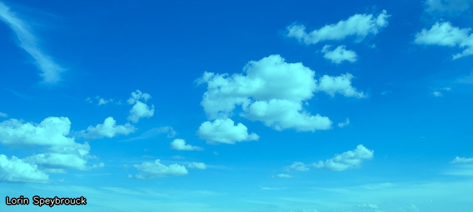

### Assignment 3
> Discolor the image by doubling the intensity of the red value of every pixel. You may have to handle an overflow problem (and use two more lines of code).

```python
doubled_red_image = clouds_image.copy()
doubled_red_image[:, :, 2] = cv2.min(doubled_red_image[:, :, 2] * 2, 255)  # Clamp at 255

cv2.imwrite('out/assignement3.jpg', doubled_red_image)
```

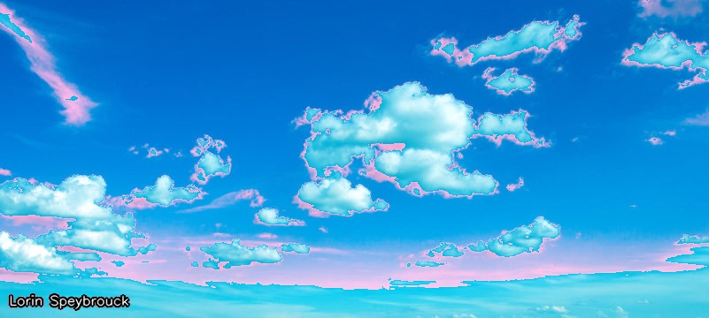

### Assignment 4
> Make a regular grid of black dots on the image so that the dots are 10 pixels apart vertically and horizontally, like in the image below.

```python
grid_image = clouds_image.copy()
dot_spacing = 10

for y in range(10, height, dot_spacing):
    for x in range(10, width-10, dot_spacing):
        cv2.circle(grid_image, (x, y), 1, (0, 0, 0), -1)

cv2.imwrite('out/assignement4.jpg', grid_image)
```

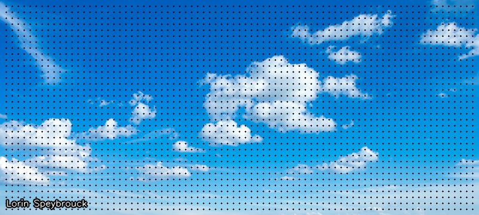

## Exercise 2
### Assignment 5 
> Convert the image to a grayscale image.

```python
grayscale_image = cv2.cvtColor(clouds_image, cv2.COLOR_BGR2GRAY)

cv2.imwrite('out/assignement5.jpg', grayscale_image)
```

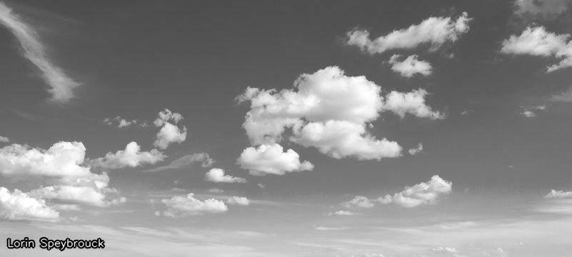

### Assignment 6 
> Threshold the grayscale image at 50% of the maximum value for this datatype.

```python
_, thresholded_image = cv2.threshold(grayscale_image, 127, 255, cv2.THRESH_BINARY)

cv2.imwrite('out/assignement6.jpg', thresholded_image)
```

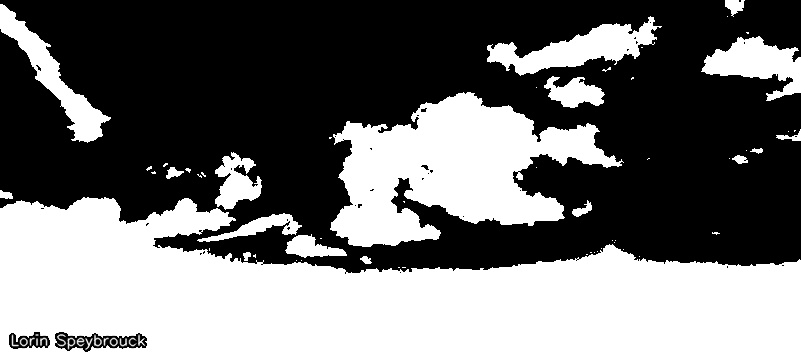

### Assignment 7 
> Threshold the grayscale image at the ideal threshold determined by Otsu’s method.

```python
_, otsu_thresholded_image = cv2.threshold(grayscale_image, 0, 255, cv2.THRESH_BINARY + cv2.THRESH_OTSU)

cv2.imwrite('out/assignement7.jpg', otsu_thresholded_image)
```

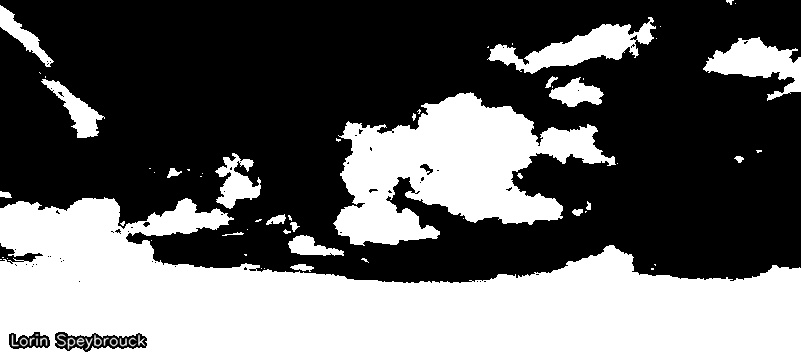

## Exercise 3
### Assignment 8
> Adaptively threshold the grayscale version of painting2.jpg so you get a similar result to the one below, where the background is uniformly white and you can cut out the painting along black lines.

```python
painting_image = cv2.imread('img/painting2.jpg', cv2.IMREAD_GRAYSCALE)

adaptive_thresholded_image = cv2.adaptiveThreshold(
    painting_image, 255, cv2.ADAPTIVE_THRESH_GAUSSIAN_C, cv2.THRESH_BINARY, 11, 5
)

cv2.imwrite('out/assignement8.jpg', adaptive_thresholded_image)
```

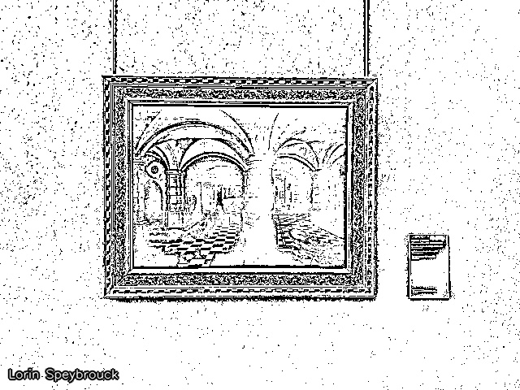

## Exercise 4
### Assignment 9
> Remove the white noise from whitenoise.png by Gaussian filtering. Find parameters for the Gaussian kernel that you find strike a good balance between noise level and blurriness of the result. This is subjective, but experiment with it!

```python
whitenoise_image = cv2.imread('img/whitenoise.png', cv2.IMREAD_GRAYSCALE)

kernel_size = (7, 7)
sigma = 2
gaussian_filtered_image = cv2.GaussianBlur(whitenoise_image, kernel_size, sigma)

cv2.imwrite('out/assignement9.jpg', gaussian_filtered_image)
```


### Question 2
> Can you choose the kernel size and sigma of the distribution independent of each other?

Non kernel size and sigma are linked.

If the kernel size is too small relative to sigma, important parts of the Gaussian distribution will be cut off, reducing accuracy. If the kernel size is too large, it increases computation time without significantly improving the result. Kernel size is often chosen as a multiple of sigma, for example 3*sigma

## Exercise 5
### Assignment 10
> Test the Gaussian filter on saltandpeppernoise.png.

```python
saltpeppernoise_image = cv2.imread('img/saltandpeppernoise.png')

kernel_size = (21, 21)
sigma = 4
gaussian_filtered_image = cv2.GaussianBlur(saltpeppernoise_image, kernel_size, sigma)
cv2.imwrite('out/assignement10.jpg', gaussian_filtered_image)
```

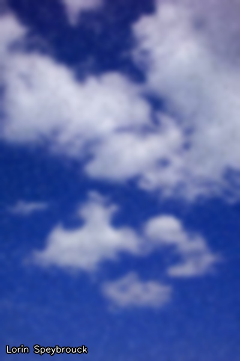

### Assignment 11
> Apply median filtering on the same image.

```python
saltpeppernoise_image = cv2.imread('img/saltandpeppernoise.png')
median_filtered_image = cv2.medianBlur(saltpeppernoise_image, 3)
cv2.imwrite('out/assignement11.jpg', median_filtered_image)
```


### Question 3
> Which result is preferable and why?

Median filtering is prefered for images with salt and pepper noise, as it discards outliers(the salt and peper), while median filtering mixes these values with the rest of the image.

## Exercise 6
### Assignment 12
> Implement unsharp masking to sharpen unsharp.png. Make sure you do not get overflow in your datatype! Your goal is to achieve something similar to the image below.

```python
unsharp_image = cv2.imread('img/unsharp.png', cv2.IMREAD_COLOR)

# Blur the image
unsharp_image_float = unsharp_image.astype(np.float32)
blurred_image = cv2.GaussianBlur(unsharp_image_float, (21, 21), 10)

# Subtract the blurred from the original
difference_image = unsharp_image_float - blurred_image

# Amplify the difference by multiplying it with a factor
amplified_difference = difference_image * 1.5

# Add this amplified difference image to the original image
sharpened_image = unsharp_image_float + amplified_difference

sharpened_image = np.clip(sharpened_image, 0, 255).astype(np.uint8)
cv2.imwrite('out/assignement12.jpg', sharpened_image)
```

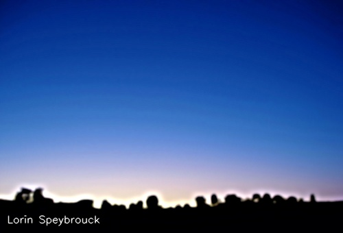

## Exercise 7
### Assignment 13
> Write a program that blurs blots.png diagonally with the kernel below (mind the multiplication factor in front).

```python
image = cv2.imread("img/blots.png")

kernel = (1/7) * np.eye(7, dtype=np.float32)
blurred_image = cv2.filter2D(image, -1, kernel)

cv2.imwrite("blurred_blots.png", blurred_image)
```

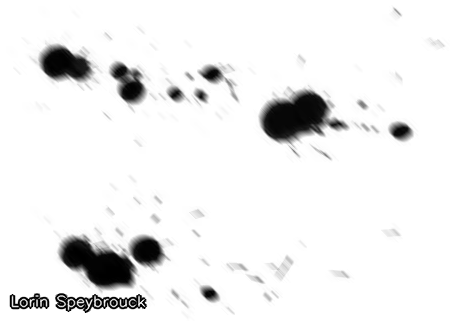
