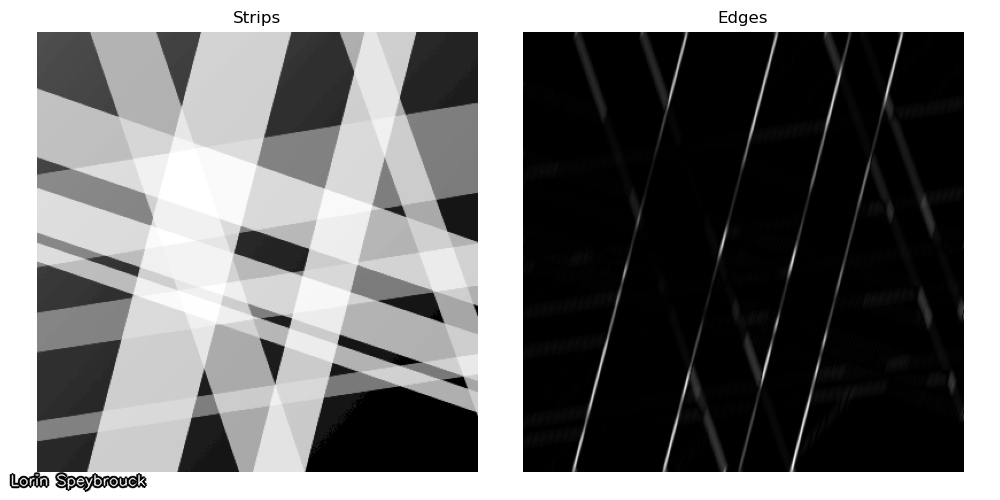
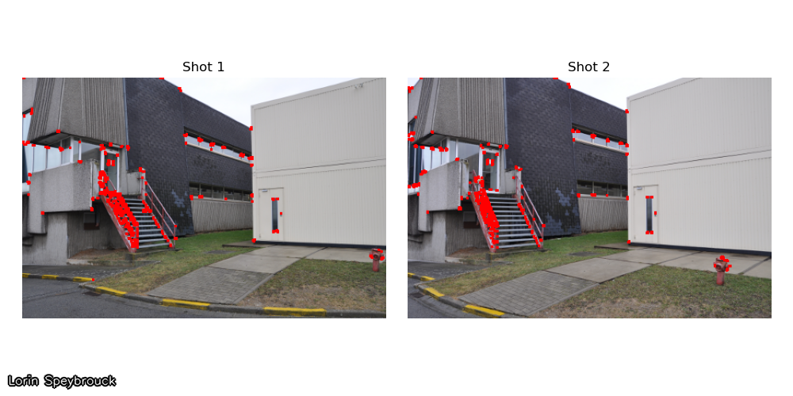

# Computer Vision Lab 2 - Feature extraction
Lorin Speybrouck

## Setup
```python
import cv2
import numpy as np

def addName(image, name="Lorin Speybrouck"):
    cv2.putText(image, name, (10, image.shape[0]-15), cv2.FONT_ITALIC, 0.5, (0,0,0), 3, cv2.LINE_AA)
    image = cv2.putText(image, name, (10, image.shape[0]-15), cv2.FONT_ITALIC, 0.5, (255,255,255), 1, cv2.LINE_AA)
    return image

def save_row(images: list, names: list, filename="out/temp.png"):
    fig, axes = plt.subplots(1, len(images), figsize=(20, 5))
    for i, (image, name) in enumerate(zip(images, names)):
        axes[i].imshow(image, cmap="gray")
        axes[i].axis("off")
        axes[i].set_title(names[i])
    plt.tight_layout(pad=2)
    plt.savefig(filename)
    cv2.imwrite(filename, addName(cv2.imread(filename)))
```

## Exercise 2
### Assignment 1
> Use the Sobel operator to calculate the vertical first-order derivative. Ensure you capture and visualize the negative filter response values by using appropriate datatypes. Your result should look similar to the one shown in Figure 1.

```python
building = cv2.imread("img/building.png", cv2.IMREAD_GRAYSCALE)
sobel_vertical = cv2.Sobel(building, cv2.CV_64F, 0, 1, ksize=3)
abs_sobel_vertical = cv2.convertScaleAbs(sobel_vertical)
cv2.imwrite("out/assignment1.png", addName(abs_sobel_vertical))
```


### Assignment 2
> Create a 15x15 DoG filter using the workflow below.

```python
def create_dog(ksize: int, sigma_1: float, sigma_2: float, angle: float, filename: str):
    gaussian_1D_1 = cv2.getGaussianKernel(ksize, sigma_1)
    matrix = np.zeros((15, 15))
    matrix[7] = gaussian_1D_1.T

    gaussian_1D_2 = cv2.getGaussianKernel(ksize, sigma_2)
    elliptical_2D_Gaussian = cv2.filter2D(matrix, -1, gaussian_1D_2)

    sobel_vertical = cv2.Sobel(elliptical_2D_Gaussian, cv2.CV_64F, 0, 1, ksize=3)

    rotation_matrix = cv2.getRotationMatrix2D((7, 7), angle, 1)
    DOG = cv2.warpAffine(
        sobel_vertical, rotation_matrix, (matrix.shape[1], matrix.shape[0])
    )

    save_row(
        [matrix, elliptical_2D_Gaussian, sobel_vertical, DOG],
        ["1D Gaussian", "Elliptical Gaussian", "Sobel filtered", "Rotated"],
        filename,
    )
    return DOG
create_dog(15, 3, 2, 45, "out/assignment2.png")
```


### Assignment 3 
Filter rays.png with a well chosen DoG filter so that in the resulting image, the edges of the
yellow strips stand out (you will need to take the absolute value of the responses).

```python
DOG = create_dog(15, 5.5, 0.4, 75, "out/temp.png")
strips = cv2.imread("img/rays.png", cv2.IMREAD_GRAYSCALE)
filtered_strips = cv2.filter2D(strips, -1, DOG)
save_row([strips, filtered_strips], ["Strips", "Edges"], "out/assignment3.png")
```



### Question 1
> What happens when your filter goes ”across the border” of the image?

When the filter goes "across the border" of the image, the filter will not have enough neighboring pixels to perform the convolution. This is fixed with border padding which can be set in filter2D parameters with borderType.

Options include
1. Zero Padding: The missing pixels are assumed to be zero.
2. Replicate Padding: The border pixels are replicated to fill the missing pixels.
3. Reflect Padding: The border pixels are mirrored to fill the missing pixels.
4. Wrap Padding: The image is treated as if it wraps around, so the missing pixels are taken from the opposite border of the image.

## Exercise 3
### Assignment 4
> Apply Canny edge detection with thresholds chosen so that the edges of all strips are detected.

```python
rays = cv2.imread("img/rays.png", cv2.IMREAD_GRAYSCALE)
edges = cv2.Canny(rays, 20, 100)
save_row([rays, edges], ["Rays", "Edges"], "out/assignment4.png")
```


## Exercise 4
### Assignment 5 
> Apply Canny edge detection so that you get the four edges of the painting, and as few other edges as possible. It is inevitable that you find other edges however.

```python
painting_gray = cv2.imread("img/painting4.jpg", cv2.IMREAD_GRAYSCALE)
edges = cv2.Canny(painting_gray, 400, 500)
save_row([painting_gray, edges], ["Painting", "Edges"], "out/assignment5.png")
```


### Assignment 6
> Apply HoughLines to the result of Assignment 5 and visualize the lines on the original image (use the line function). It is normal too get too many lines, since you cannot get the Canny result perfect.

```python
painting_color = cv2.imread("img/painting4.jpg")
lines = cv2.HoughLines(edges, 1, np.pi / 180, 150)

if lines is not None:
    for rho, theta in lines[:, 0]:
        a = np.cos(theta)
        b = np.sin(theta)
        x0 = a * rho
        y0 = b * rho
        x1 = int(x0 + 1000 * (-b))
        y1 = int(y0 + 1000 * (a))
        x2 = int(x0 - 1000 * (-b))
        y2 = int(y0 - 1000 * (a))
        cv2.line(painting_color, (x1, y1), (x2, y2), (0, 0, 255), 2)

cv2.imwrite("out/assignment6.png", addName(painting_color))
```


## Exercise 5
### Assignment 7 
> Detect Harris corners in shot1.png and shot2.png and visualize them side by side.

```python
def detect_harris_corners(image, blocksize, ksize, k, threshold=0.01):
    gray = cv2.cvtColor(image, cv2.COLOR_BGR2GRAY)
    gray = np.float32(gray)
    dst = cv2.cornerHarris(gray, blocksize, ksize, k)
    dst = cv2.dilate(dst, None)
    image[dst > threshold * dst.max()] = [0, 0, 255]
    return image


shot1 = cv2.imread("img/shot1.png")
shot2 = cv2.imread("img/shot2.png")
shot1_corners = detect_harris_corners(shot1, 2, 3, 0.04, 0.04)
shot2_corners = detect_harris_corners(shot2, 2, 3, 0.04, 0.04)

save_row(
    [rgb_image(shot1_corners), rgb_image(shot2_corners)],
    ["Shot 1", "Shot 2"],
    "out/assignment7.png",
)
```



### Question 2 
> Name two kinds of problems you foresee in trying to match these corners.

- Missing corners: not every corner is consistently detected, so you could have to match with a corner that is not there
- False positive: not every detected point is a corner

### Assignment 8
> Detect ORB features in each of the two original images, calculate the ORB descriptors for them, and match the descriptors between the two images. Visualize the 32 best matches.

```python
shot1 = cv2.imread("img/shot1.png")
shot2 = cv2.imread("img/shot2.png")

orb = cv2.ORB_create()
keypoints1, descriptors1 = orb.detectAndCompute(shot1, None)
keypoints2, descriptors2 = orb.detectAndCompute(shot2, None)
bf = cv2.BFMatcher(cv2.NORM_HAMMING, crossCheck=True)
matches = bf.match(descriptors1, descriptors2)
matches = sorted(matches, key=lambda x: x.distance)
match_img = cv2.drawMatches(
    shot1,
    keypoints1,
    shot2,
    keypoints2,
    matches[:32],
    None,
    flags=cv2.DrawMatchesFlags_NOT_DRAW_SINGLE_POINTS,
)

cv2.imwrite("out/assignment8.png", addName(match_img))
```


