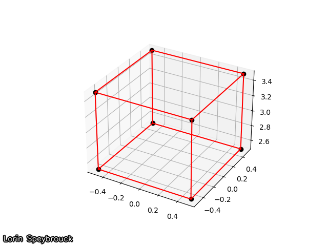
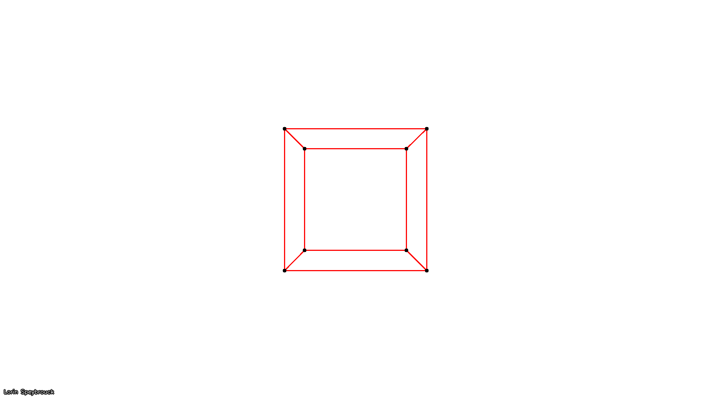
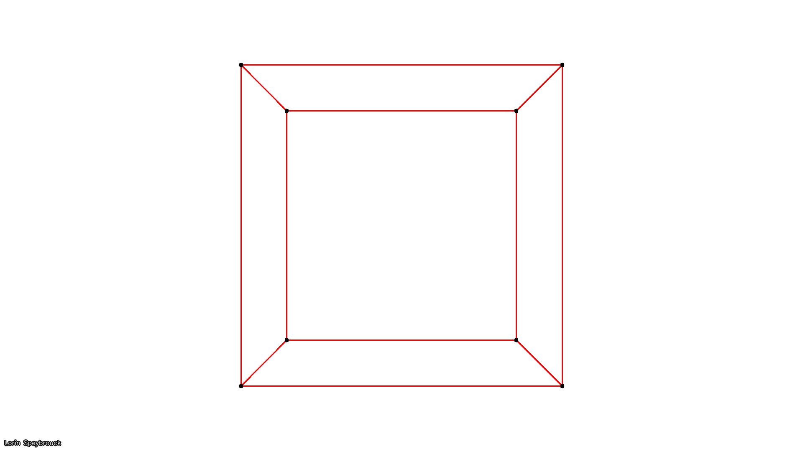
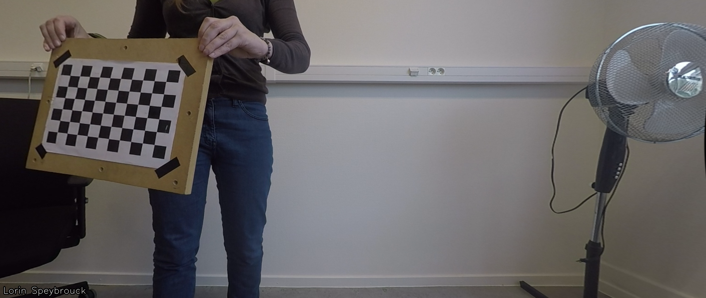
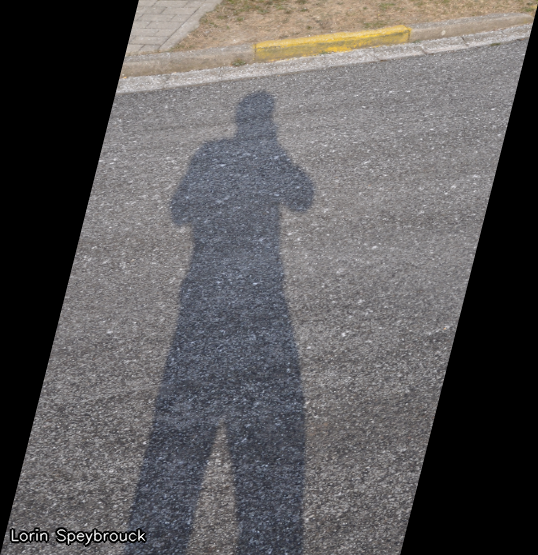
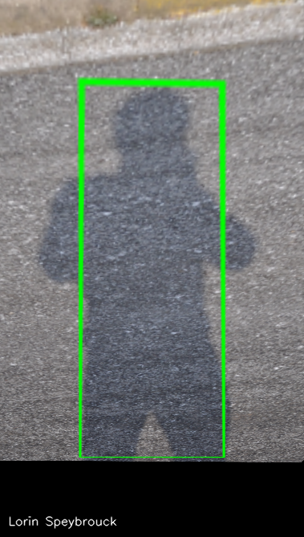

# Computer Vision Lab 3 - Image formation and transformations
Lorin Speybrouck

## Setup
```python
import cv2
import numpy as np

def addName(image, name="Lorin Speybrouck"):
    cv2.putText(image, name, (10, image.shape[0]-15), cv2.FONT_ITALIC, 0.5, (0,0,0), 3, cv2.LINE_AA)
    image = cv2.putText(image, name, (10, image.shape[0]-15), cv2.FONT_ITALIC, 0.5, (255,255,255), 1, cv2.LINE_AA)
    return image

def save_row(images: list, names: list, filename="out/temp.png"):
    fig, axes = plt.subplots(1, len(images), figsize=(20, 5))
    for i, (image, name) in enumerate(zip(images, names)):
        axes[i].imshow(image, cmap="gray")
        axes[i].axis("off")
        axes[i].set_title(names[i])
    plt.tight_layout(pad=2)
    plt.savefig(filename)
    cv2.imwrite(filename, addName(cv2.imread(filename)))
```

## Exercise 1
### Question 1 
> What is the camera matrix for a 1080p camera with a horizontal field of view of 90 degrees?

`Intrinsic camera matrix`
$$ K =
\begin{bmatrix} 
f & 0 & c_x \\ 
0 & f & c_y \\ 
0 & 0 & 1
\end{bmatrix} $$
- $f$: focal distance, $f=\frac{(\text{width}/2)}{\tan(\text{FOV}/2)}$
- $c_x$: X coordinate of principal point
- $c_y$: Y coordinate of principal point

`Answer`
$$ K = \begin{bmatrix} 960 & 0 & 960 \\ 0 & 960 & 540 \\ 0 & 0 & 1 \end{bmatrix} $$

### Assignment 1
> Create a virtual 3D cube with a side of 1 meter, defined as an 8x3 matrix containing the 3D coordinates of the vertices of the cube relative to the camera (you can choose the exact position, picture the situation in your head or make a quick freehand diagram), and a 12x2 array of edges described by pairs of vertex indices that need to be connected by lines;

> Project the 3D vertex coordinates to 2D image coordinates using your camera matrix from Question 1, and visualize the result by drawing the vertices and edges on an empty 1080p image. Pay attention to the dimensions of your matrices, transpose as necessary and round the image coordinates to integer pixels.

```python
def assignment1():
    vertices = np.array(
        [
            [-0.5, -0.5, 2.5],  # vertex 0 (front bottom left)
            [0.5, -0.5, 2.5],  # vertex 1 (front bottom right)
            [0.5, 0.5, 2.5],  # vertex 2 (front top right)
            [-0.5, 0.5, 2.5],  # vertex 3 (front top left)
            [-0.5, -0.5, 3.5],  # vertex 4 (back bottom left)
            [0.5, -0.5, 3.5],  # vertex 5 (back bottom right)
            [0.5, 0.5, 3.5],  # vertex 6 (back top right)
            [-0.5, 0.5, 3.5],  # vertex 7 (back top left)
        ]
    )
    edges = np.array(
        [
            [0, 1],
            [1, 2],
            [2, 3],
            [3, 0],  # front face
            [4, 5],
            [5, 6],
            [6, 7],
            [7, 4],  # back face
            [0, 4],
            [1, 5],
            [2, 6],
            [3, 7],  # connecting edges
        ]
    )
    FOV = 90
    f = (1920 / 2) / m.tan(m.radians(FOV / 2))
    K = np.array([[f, 0, 960], [0, f, 540], [0, 0, 1]])

    # 3D plot
    fig = plt.figure()
    ax = fig.add_subplot(111, projection="3d")
    ax.plot(*vertices.T, marker="o", color="k", ls="")
    [ax.plot(*vertices[[start, end], :].T, color="r") for start, end in edges]
    filename = "out/assignment1_3d.png"
    plt.savefig(filename)
    cv2.imwrite(filename, addName(cv2.imread(filename)))

    # Project
    verteces_p = []
    for vertex in vertices:
        vertex_p = K @ vertex
        vertex_p = vertex_p / vertex_p[2]
        verteces_p.append(vertex_p)

    # 2D plot
    image = np.ones((1080, 1920, 3), dtype=np.uint8) * 255

    for start, end in edges:
        start_point = (int(verteces_p[start][0]), int(verteces_p[start][1]))
        end_point = (int(verteces_p[end][0]), int(verteces_p[end][1]))
        cv2.line(image, start_point, end_point, (0, 0, 255), 2)
    for point in verteces_p:
        center = (int(point[0]), int(point[1]))
        cv2.circle(image, center, 5, (0, 0, 0), -1)

    cv2.imwrite("out/assignment1_2d.png", addName(image))
assignment1()
```




### Question 2
> If you double the focal distance, what happens to the picture?

The picture is more zoomed in and the field of view is reduced. There is also perspective compression, where objects at different distances from the camera appear more similar in size, reducing the perceived depth in the image.



### Question 3
> Why are there only even powers in this polynomial in r?

`Real to pinhole coordinates`
$$ \begin{cases}
x_{\text{pinhole}} = c_x+(x_{\text{orig}}-c_x)(1+k_1r^2+k_2r^4) \\
y_{\text{pinhole}} = c_y+(y_{\text{orig}}-c_y)(1+k_1r^2+k_2r^4)
\end{cases} $$
- $r=\sqrt{(x_{\text{orig}}-c_x)^2+(y_{\text{orig}}-c_y)^2}$

`Answer:` because even power approximate the distortion, which is symmetric, better. Even powers of r will result in a symmetric model (uneven powers are asymmetric functions)

## Exercise 2
### Assignment 2
> Determine the intrinsic matrix and distortion parameters of the GoPro camera used to shoot the calibration sequence you find on Ufora as calibration_frames.zip. Print the matrix and coefficients in your report.

```python
def calculate_camera_calibration(images: list[str], patternSize: tuple[int, int]):
    criteria = (cv.TERM_CRITERIA_EPS + cv.TERM_CRITERIA_MAX_ITER, 30, 0.001)

    w, h = patternSize
    objp = np.zeros((w * h, 3), np.float32)
    objp[:, :2] = np.mgrid[0:w, 0:h].T.reshape(-1, 2)
    objpoints = []  # 3d point in real world space
    imgpoints = []  # 2d points in image plane

    for fname in images:
        img = cv.imread(fname)
        gray = cv.cvtColor(img, cv.COLOR_BGR2GRAY)
        ret, corners = cv.findChessboardCorners(gray, patternSize, None)

        if ret == True:
            objpoints.append(objp)
            corners2 = cv.cornerSubPix(gray, corners, (11, 11), (-1, -1), criteria)
            imgpoints.append(corners2)

            # Debug show chessboard
            # cv.drawChessboardCorners(img, patternSize, corners2, ret)
            # cv.imshow(fname, img)
            # cv.waitKey(500)

    # print(f"Found {len(objpoints)} of {len(images)}")
    cv.destroyAllWindows()
    ret, mtx, dist, rvecs, tvecs = cv.calibrateCamera(objpoints, imgpoints, gray.shape[::-1], None, None)

    mean_error = 0
    for i in range(len(objpoints)):
        imgpoints2, _ = cv.projectPoints(objpoints[i], rvecs[i], tvecs[i], mtx, dist)
        error = cv.norm(imgpoints[i], imgpoints2, cv.NORM_L2)/len(imgpoints2)
        mean_error += error
    
    total_error = mean_error/len(objpoints)

    return mtx, dist, total_error

def assignment2():
    patternSize = (10, 6)
    image_numbers = list(range(3, 60))
    images = [f"calibration_frames/img_{num:04d}.png" for num in image_numbers]

    mtx, dist, error = calculate_camera_calibration(images, patternSize)
    print(f"Camera matrix(Error={error}):")
    print(mtx)
    print("Distortion coefficients:")
    print(dist)
assignment2()
```
```
Camera matrix:
    [[582.17453376   0.         645.00232214]
    [  0.         586.04052211 340.48163159]
    [  0.           0.           1.        ]]
Distortion coefficients:
    [[-2.36033444e-01  6.22732126e-02 -1.50927881e-03 -1.39902307e-04 -8.06962376e-03]]
```

### Assignment 3
> Do the calibration procedure for 5 different random subsets of 20 frames. Print the camera matrix for each set.

```python
def calculate_random_camera_calibration(_=None):
    patternSize = (10, 6)
    random_numbers = [r.randint(3, 59) for _ in range(20)]
    images = [f"calibration_frames/img_{num:04d}.png" for num in random_numbers]

    mtx, dist, error = calculate_camera_calibration(images, patternSize)
    return mtx, dist, error

def assignment3():
    for i in range(5):
        mtx, dist, error = calculate_random_camera_calibration()
        print(f"Camera matrix {i}(Error={error}):")
        print(mtx)
assignment3()
```
```
Camera matrix (0):
    [[571.286901     0.         635.33077281]
    [  0.         575.13963364 338.97078224]
    [  0.           0.           1.        ]]
Camera matrix (1):
    [[769.87657308   0.         621.68569283]
    [  0.         756.36188015 403.03788843]
    [  0.           0.           1.        ]]
Camera matrix (2):
    [[717.00119237   0.         654.86661692]
    [  0.         712.18342053 370.04713546]
    [  0.           0.           1.        ]]
Camera matrix (3):
    [[623.73786123   0.         655.06586757]
    [  0.         624.73535317 365.47673025]
    [  0.           0.           1.        ]]
Camera matrix (4):
    [[660.94999924   0.         616.59472522]
    [  0.         661.16380022 381.34631074]
    [  0.           0.           1.        ]]
```

### Question 4
> How can you find out which calibration is the best? Look in the opencv documentation.

To determine which calibration is the best, we can compare the re-projection errors of each calibration. The re-projection error gives an estimation of how accurate the found parameters are. The closer the re-projection error is to zero, the more accurate the parameters. 

We calculate the re-projection error by transforming the object points to image points using cv.projectPoints() and then calculating the absolute norm between the transformed points and the points found by the corner finding algorithm. The average error then is the arithmetical mean of the errors calculated for all the calibration images.

```python
# OpenCV documentation
mean_error = 0
for i in range(len(objpoints)):
    imgpoints2, _ = cv.projectPoints(objpoints[i], rvecs[i], tvecs[i], mtx, dist)
    error = cv.norm(imgpoints[i], imgpoints2, cv.NORM_L2)/len(imgpoints2)
    mean_error += error
 
print( "total error: {}".format(mean_error/len(objpoints)))
```

### Assignment 4
> Use your best calibration result to undistort one of the frames from the sequence. Lines that are straight in reality should be straight in your rectified image now.

```python
def find_best_calibration(iterations=100):
    with Pool(processes=12) as P:
        calibrations = P.map(calculate_random_camera_calibration, range(iterations))
        best_calibration = min(calibrations, key=lambda x: x[2])
        return best_calibration

def assignment4():
    mtx, dist, error = find_best_calibration(1000)
    print(f"Best camera matrix(Error={error}):")
    print(mtx)
    print("Distortion coefficients:")
    print(dist)

    img = cv.imread('calibration_frames/img_0053.png')
    h,  w = img.shape[:2]
    w1,h1 = 3*w,3*h
    newcameramtx, roi = cv.getOptimalNewCameraMatrix(mtx, dist, (w,h), 1, (w,h))

    mapx, mapy = cv.initUndistortRectifyMap(mtx, dist, None, newcameramtx, (w1,h1), 5)
    dst = cv.remap(img, mapx, mapy, cv.INTER_LINEAR)
    
    x, y, w, h = roi
    dst = dst[y:y+h, x:x+w]

    cv.imwrite('assignment4.png', dst)
assignment4()
```


## Exercise 3
### Assignment 5
> Shear shadow.png so that the photographer’s shadow becomes vertical. Size your target image so that it will be large enough to accommodate the sheared image, and make sure that all parts of the original image are visible. You can add translation by placing pixel offsets in the third column.

```python
def assignment5():
    img = cv2.imread('img/shadow.png')
    h, w = img.shape[:2]

    m = -0.25 # Shear factor
    x_translation = abs(m * h) if m < 0 else 0
    M = np.float32([[1, m, x_translation], [0, 1, 0]])
    new_width = int(w + abs(m * h))
    
    result = cv2.warpAffine(img, M, (new_width, h))
    cv2.imwrite('out/assignment5.png', addName(result))
assignment5()
```



## Exercise 4
## Assignment 6
> Apply a perspective transform to shadow box.png so that the photographer in not only stands vertically, but is also proportionally correct. In your program you click on the 4 corners of the tetragon that you want to transform into a rectangle, after which the right perspective transformation is searched for and executed. In order to make an image display window clickable, you have to set a mouse callback function that is called anytime your mouse pointer interacts in some way with the window.

```python
def onMouse(event, x, y, flags, param):
    if event == cv2.EVENT_LBUTTONDOWN:
        param.append((x, y))
        print(f"Point selected: {(x, y)}")
        if len(param) == 4:
            cv2.destroyAllWindows()

def assignment6():
    image = cv2.imread('img/shadow_box.png')
    selected_points = []

    cv2.namedWindow('Select 4 points')
    cv2.setMouseCallback('Select 4 points', onMouse, selected_points)

    while len(selected_points) < 4:
        cv2.imshow(f'Select 4 points', image)
        cv2.waitKey(1)

    x_offset = 100
    y_offset = 100

    src_points = np.array(selected_points, dtype='float32')
    width = max(np.linalg.norm(src_points[0] - src_points[1]), np.linalg.norm(src_points[2] - src_points[3])) + 2 * x_offset
    height = max(np.linalg.norm(src_points[0] - src_points[3]), np.linalg.norm(src_points[1] - src_points[2])) + 2 * y_offset

    dst_points = np.array([
        [x_offset, y_offset],
        [width - x_offset, y_offset],
        [width -x_offset, height  - y_offset],
        [x_offset, height - y_offset]
    ], dtype='float32')

    M = cv2.getPerspectiveTransform(src_points, dst_points)
    warped = cv2.warpPerspective(image, M, (int(width), int(height)))

    cv2.imwrite('out/assignment6.png', addName(warped))
assignment6()
```


### Question 5
> Can you do this for 5 point correspondences instead of 4? How could such an overdetermined system be solved?

Yes we can do this for 5 point correspondences, this wil result in an overdetermined system, which can then be solved using a least squares method. 

In a least squares method, we minimize the sum of the squared differences between the observed and predicted values. For the perspective transform, this involves setting up a system of linear equations based on the 5 point correspondences and then solving for the transformation matrix that minimizes the error.
