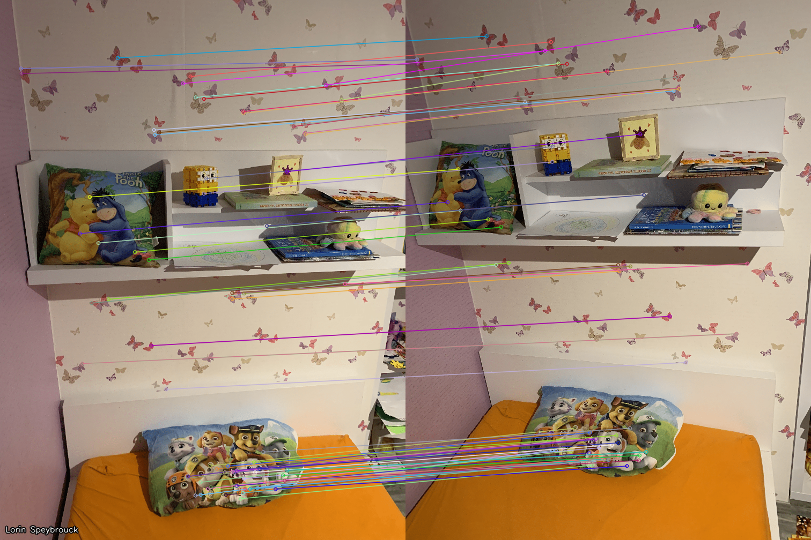
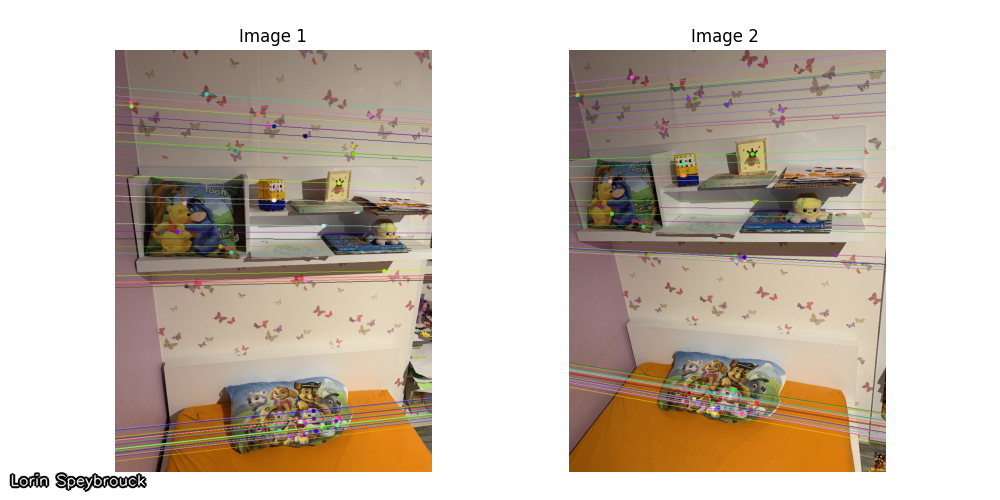

# Computer Vision Lab 4 - Multi-view geometry
Lorin Speybrouck

## Setup
```python
import cv2
import numpy as np

def addName(image, name="Lorin Speybrouck"):
    cv2.putText(image, name, (10, image.shape[0]-15), cv2.FONT_ITALIC, 0.5, (0,0,0), 3, cv2.LINE_AA)
    image = cv2.putText(image, name, (10, image.shape[0]-15), cv2.FONT_ITALIC, 0.5, (255,255,255), 1, cv2.LINE_AA)
    return image

def save_row(images: list, names: list, filename="out/temp.png"):
    fig, axes = plt.subplots(1, len(images), figsize=(20, 5))
    for i, (image, name) in enumerate(zip(images, names)):
        axes[i].imshow(image, cmap="gray")
        axes[i].axis("off")
        axes[i].set_title(names[i])
    plt.tight_layout(pad=2)
    plt.savefig(filename)
    cv2.imwrite(filename, addName(cv2.imread(filename)))
```

## Exercise 1
### Assignment 1
> Compute SIFT keypoints (or other features of your choice) and descriptors in both images and match them. Use k nearest neighbor matching and reject ambiguous matches based on Lowe’s ratio test. Show the matches.

```python
def assignment1():
    image1 = cv2.imread("img/im00.png")
    image2 = cv2.imread("img/im01.png")
    gray1 = cv2.cvtColor(image1, cv2.COLOR_BGR2GRAY)
    gray2 = cv2.cvtColor(image2, cv2.COLOR_BGR2GRAY)

    # SIFT keypoints and descriptors
    sift = cv2.SIFT_create()
    kp1, des1 = sift.detectAndCompute(gray1, None)
    kp2, des2 = sift.detectAndCompute(gray2, None)

    # Match descriptors
    bf = cv2.BFMatcher()
    matches = bf.knnMatch(des1, des2, k=2)

    # Lowe's ratio test
    good_matches = []
    for m, n in matches:
        if m.distance < 0.425 * n.distance:
            good_matches.append(m)
    print (len(good_matches))

    matched_image = cv2.drawMatches(image1, kp1, image2, kp2, good_matches, None, flags=cv2.DrawMatchesFlags_NOT_DRAW_SINGLE_POINTS)
    cv2.imwrite("out/assignment1.png", addName(matched_image))
assignment1()
```


### Assignment 2
> Estimate the fundamental matrix using findFundamentalMat, compute the epipolar lines for the feature points you used (you can use computeCorrespondEpilines) and draw these onto both images.

```python
def draw_epilines(image: MatLike, lines: MatLike, points: MatLike):
    r, c = image.shape[:2]
    image = cv2.cvtColor(image, cv2.COLOR_BGR2RGB)
    for r, pt in zip(lines, points):
        color = tuple(np.random.randint(0, 255, 3).tolist())
        x0, y0 = map(int, [0, -r[2] / r[1]])
        x1, y1 = map(int, [c, -(r[2] + r[0] * c) / r[1]])
        image = cv2.line(image, (x0, y0), (x1, y1), color, 1)
        image = cv2.circle(image, tuple(pt), 5, color, -1)
    return image

def assignment2():
    image1 = cv2.imread("img/im00.png")
    image2 = cv2.imread("img/im01.png")

    kp1, kp2, good_matches = compute_keypoints_and_match(image1, image2)
    points1 = np.int32([kp1[match.queryIdx].pt for match in good_matches])
    points2 = np.int32([kp2[match.trainIdx].pt for match in good_matches])
    
    F, mask = cv2.findFundamentalMat(points1, points2, cv2.FM_LMEDS)
    print("Fundamental matrix:\n", F)

    # Select only inlier points
    points1 = points1[mask.ravel() == 1]
    points2 = points2[mask.ravel() == 1]

    lines1 = cv2.computeCorrespondEpilines(points2.reshape(-1, 1, 2), 2, F).reshape(-1, 3)
    img1_with_lines = draw_epilines(image1, lines1, points1)
    lines2 = cv2.computeCorrespondEpilines(points1.reshape(-1, 1, 2), 1, F).reshape(-1, 3)
    img2_with_lines = draw_epilines(image2, lines2, points2)

    save_row([img1_with_lines, img2_with_lines], ["Image 1", "Image 2 "], "out/assignment2.png")
assignment2()
```

```
Fundamental matrix:
 [[-1.83209209e-06  1.40458492e-04 -5.59936281e-02]
 [ 9.58277093e-05 -3.93478309e-05 -4.16022650e-01]
 [-3.77972193e-02  3.71826464e-01  1.00000000e+00]]
```

## Exercise 2
### Assignment 3
> Compute the essential matrix from the fundamental matrix you estimated in Assignment 2, using Equation 7 and the matrix above.

> Compute the translation and rotation from the essential matrix using decomposeEssentialMat. Print the rotation and translation matrices in your report.

```python
def assignment3():
    image1 = cv2.imread("img/im00.png")
    image2 = cv2.imread("img/im01.png")

    kp1, kp2, good_matches = compute_keypoints_and_match(image1, image2)
    points1 = np.int32([kp1[match.queryIdx].pt for match in good_matches])
    points2 = np.int32([kp2[match.trainIdx].pt for match in good_matches])
    F, mask = cv2.findFundamentalMat(points1, points2, cv2.FM_LMEDS)

    K = np.array([[792, 0, 505], [0, 791, 376], [0, 0, 1]])
    E = K.T @ F @ K

    R1, R2, t = cv2.decomposeEssentialMat(E)

    print("Rotation matrix 1:\n", R1)
    print("Rotation matrix 2:\n", R2)
    print("Translation vector:\n", t)
assignment3()
```
```
Rotation matrix 1:
 [[ 0.90092584  0.02823101  0.43305385]
 [ 0.00393428  0.99730952 -0.07320001]
 [-0.43395524  0.06765154  0.89839085]]
Rotation matrix 2:
 [[ 0.99818612  0.01038586 -0.05930101]
 [ 0.01494217 -0.99692568  0.07691497]
 [-0.05831987 -0.07766154 -0.99527256]]
Translation vector:
 [[ 0.9679629 ]
 [ 0.00962118]
 [-0.25090887]]
```

### Question 1
> You get two possible rotation matrices, which one do you think is correct? Hint: read Question 3 below.

We get 2 possible rotation matrices, one that places object point in front of the camera, and one that places object points behind the camera(impossible). We can check this using a cheirality test, which checks if the reconstructed 3D points are in front of both camera. In this case the first rotation matrix is the correct one.

### Assignment 4
> Convert the keypoint coordinates you used in Assignment 2 to normalized coordinates (for both images) by multiplying the inverse camera matrix with them.

> Compute the essential matrix by using findFundamentalMat on these normalized points. The resulting matrix is immediately the essential matrix!

> Compute the translation and rotation matrices once again with decomposeEssentialMat and print them in your report. They should be close to results from Assignment 3, if not, you have a problem!

```python
def assignment4():
    image1 = cv2.imread("img/im00.png")
    image2 = cv2.imread("img/im01.png")

    kp1, kp2, good_matches = compute_keypoints_and_match(image1, image2)
    points1 = np.float32([kp1[match.queryIdx].pt for match in good_matches])
    points2 = np.float32([kp2[match.trainIdx].pt for match in good_matches])

    K = np.array([[792, 0, 505], [0, 791, 376], [0, 0, 1]])
    K_inv = np.linalg.inv(K)

    points1_normalized = cv2.undistortPoints(np.expand_dims(points1, axis=1), K, None)
    points2_normalized = cv2.undistorstPoints(np.expand_dims(points2, axis=1), K, None)
    E, mask = cv2.findFundamentalMat(points1_normalized, points2_normalized, cv2.FM_LMEDS)

    R1, R2, t = cv2.decomposeEssentialMat(E)

    print("Rotation matrix 1:\n", R1)
    print("Rotation matrix 2:\n", R2)
    print("Translation vector:\n", t)
assignment4()
```
```
Rotation matrix 1:
 [[ 0.89905433  0.0271129   0.43699679]
 [ 0.00437026  0.9974754  -0.0708782 ]
 [-0.43781526  0.06563314  0.89666609]]
Rotation matrix 2:
 [[ 0.98785973  0.04728899  0.147976  ]
 [ 0.03521893 -0.99591438  0.08315146]
 [ 0.15130357 -0.07693043 -0.98548919]]
Translation vector:
 [[ 0.98845505]
 [ 0.02073869]
 [-0.15008841]]
```

### Question 2
> The translation is only up to a scale factor. Does it correspond to your visual assessment of the perspective difference between the shots? Explain.

When lookin at the perspecive difference between the two shots we can mainly see movement to the right, little verical movement and a little zooming and a little backward movemenet(zooming out). When we compare this with the translation vector, this matches. The X component is positive(movement to the right), the Y component is small and the z component is negative(moving backwards).

### Question 3
> Assuming that this rotation matrix would be a pure rotation along the Y axis (vertical), what would be the approximate angle of the rotation?

For a rotation matrix $R$ around the Y-axis, the angle $ϑ$ can be extracted using the following relationship $ϑ = \arcsin(R_{13})$. When applied to the previous rotation matrix this results in an angle of $25.91°$
