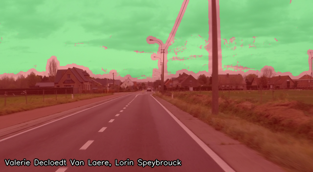
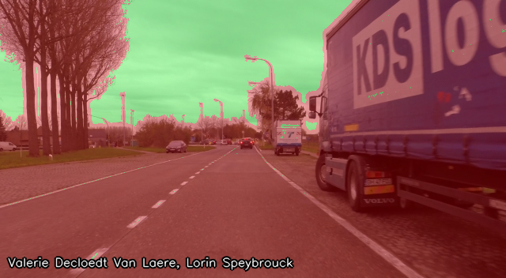
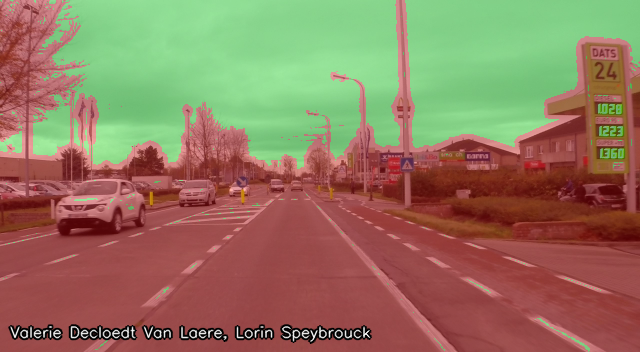
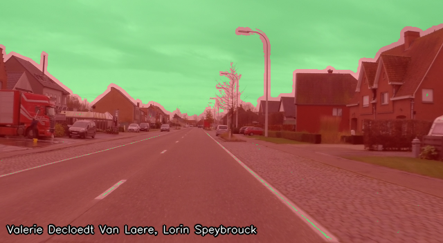
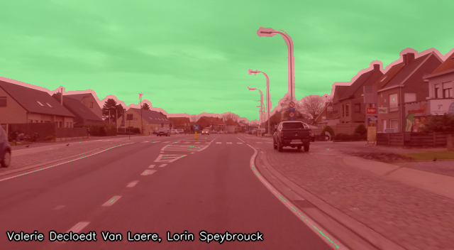
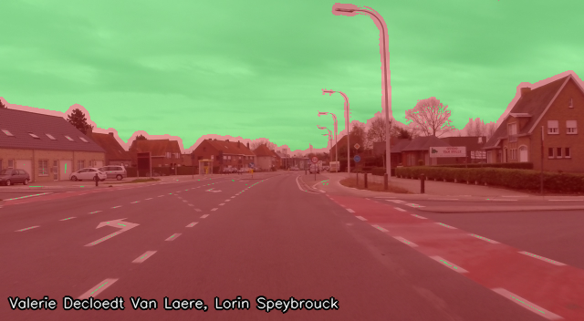

# Computer Vision Lab 5 - Classification
Lorin Speybrouck, Valerie Decloedt Van Laere

## Setup
```python
import cv2
import numpy as np

def addName(image, name="Valerie Decloedt Van Laere, Lorin Speybrouck"):
    cv2.putText(image, name, (10, image.shape[0]-15), cv2.FONT_ITALIC, 0.5, (0,0,0), 3, cv2.LINE_AA)
    image = cv2.putText(image, name, (10, image.shape[0]-15), cv2.FONT_ITALIC, 0.5, (255,255,255), 1, cv2.LINE_AA)
    return image

def save_row(images: list, names: list, filename="out/temp.png"):
    fig, axes = plt.subplots(1, len(images), figsize=(20, 5))
    for i, (image, name) in enumerate(zip(images, names)):
        axes[i].imshow(image, cmap="gray")
        axes[i].axis("off")
        axes[i].set_title(names[i])
    plt.tight_layout(pad=2)
    plt.savefig(filename)
    cv2.imwrite(filename, addName(cv2.imread(filename)))
```

## Exercise 1
### Assignment 1
> Make a filterbank of DoG filters in 2 scales and 6 orientations (so 12 filters in total). Visualize the filters as in Figure 2.

#### Code
```python
def create_dog_filter(ksize: int, sigma_1: float, sigma_2: float, angle: float):
    half_ksize = int(ksize / 2)
    gaussian_1D_1 = cv2.getGaussianKernel(ksize, sigma_1)
    matrix = np.zeros((ksize, ksize))
    matrix[half_ksize] = gaussian_1D_1.T

    gaussian_1D_2 = cv2.getGaussianKernel(ksize, sigma_2)
    elliptical_2D_Gaussian = cv2.filter2D(matrix, -1, gaussian_1D_2)

    sobel_vertical = cv2.Sobel(elliptical_2D_Gaussian, cv2.CV_64F, 0, 1, ksize=3)

    rotation_matrix = cv2.getRotationMatrix2D((half_ksize, half_ksize), angle, 1)
    DOG = cv2.warpAffine(
        sobel_vertical, rotation_matrix, (matrix.shape[1], matrix.shape[0])
    )
    return DOG

def assignment1():
    DOGs = [create_dog_filter(19, 3.5, 1.5, i * 30) for i in range(6)] + [
        create_dog_filter(9, 2, 0.8, i * 30) for i in range(6)
    ]
    save_row(DOGs, "out/assignment1.png")
```

### Result


### Assignment 2
> Filter road*.png with each of the filters. This gives you 12 filter response images. Make sure they are floating point and contain negative values!

> Append the 12 filter response images to the blue, green and red channels to make a 15-channel image, from which you can extract a 15-dimensional feature vector for each pixel. If you imagine the 15 channels as a stack of images lying on top of each other, each pixel’s feature vector is a vertical string of values from the stack of images.

> Train and test a new QDA classifier on the 15-dimensional feature vectors of all pixels of all four images. (Show the classification result in your report)

#### Code
```python
def create_features_and_values(
    image_paths: list[str], label_paths: list[str], DOGs: list[MatLike], assignment: str
):
    test_images = [cv2.imread(path) for path in image_paths[:2]]
    test_images_grayscale = [cv2.cvtColor(image, cv2.COLOR_BGR2GRAY) for image in test_images]
    labels = [cv2.imread(path, cv2.IMREAD_GRAYSCALE) for path in label_paths]

    # Apply DOG filter
    images_responses = [
        [cv2.filter2D(image, cv2.CV_64F, dog) for dog in DOGs] for image in test_images_grayscale
    ]

    # Save filter responses
    for i, image_response in enumerate(images_responses):
        for j, response in enumerate(image_response):
            plt.imsave(f"debug/{assignment}-{i}-{j}.png", response, cmap="gray")

    # Create features and values
    RGB_features = [RGB for image in test_images for RGB in image.reshape(-1, 3)]
    response_features = [
        responses
        for image_responses in images_responses
        for responses in np.stack(image_responses, axis=-1).reshape(-1, len(DOGs))
    ]
    features = np.concatenate((RGB_features, response_features), axis=1)
    # features = np.array(RGB_features)
    values = np.concatenate(labels).flatten()

    # Filter
    which = np.union1d(np.where(values == 255), np.where(values == 0))
    features = features[which, :]
    values = values[which]

    return features, values


def test_classifier(
    classifier: BaseEstimator, image_paths: list[str], DOGs: list[MatLike], assignment: str
):
    for i, image_path in enumerate(image_paths):
        image = cv2.imread(image_path)
        image_grayscale = cv2.cvtColor(image, cv2.COLOR_BGR2GRAY)
        image_response = [cv2.filter2D(image_grayscale, cv2.CV_64F, dog) for dog in DOGs]

        RGB_features = image.reshape(-1, 3)
        response_features = np.stack(image_response, axis=-1).reshape(-1, len(DOGs))
        features = np.concatenate((RGB_features, response_features), axis=1)
        # features = RGB_features

        predictions = classifier.predict(features).reshape((image.shape[0], image.shape[1]))
        predictions_mask = cv2.merge(
            (
                np.zeros(predictions.shape, float),
                (predictions == 255).astype(float),
                (predictions == 0).astype(float),
            )
        )

        cv2.imwrite(
            f"out/{assignment}-{i}.png",
            addName((0.7 * image + 0.3 * predictions_mask * 255).astype(np.uint8)),
        )


def assignment2():
    # Setup
    image_paths = sorted(glob("img/road?.png"))
    label_paths = sorted(glob("img/road?_skymask.png"))
    DOGs = [create_dog_filter(19, 3.5, 1.5, i * 30) for i in range(6)] + [
        create_dog_filter(9, 2, 0.8, i * 30) for i in range(6)
    ]
    features, values = create_features_and_values(image_paths, label_paths, DOGs, "assignment2")

    # Train
    classifier = QuadraticDiscriminantAnalysis()
    classifier.fit(features, values)
    print(f"Mean training accuracy: {classifier.score(features, values)}")

    # Test
    test_classifier(classifier, image_paths, DOGs, "assignment2")
```

#### Training
Mean training accuracy: 0.9908042137926019

#### Results





## Exercise 2
### Assignment 3 
> Replace the QDA classifier you trained in Exercise 14 with a random forest classifier. Pay attention to the main parameters: (Show the classification result in your report)
> - The number of decision trees, controlling the overall complexity of the classifier (related to the complexity of the data)
> - The minimum leaf size, which controls how many samples must be grouped together as a minimum at the end of each decision tree (usually specified as a fraction of the total data).

#### Code
```python
def assignment3():
    # Setup
    image_paths = sorted(glob("img/road?.png"))
    label_paths = sorted(glob("img/road?_skymask.png"))
    DOGs = [create_dog_filter(19, 3.5, 1.5, i * 30) for i in range(6)] + [
        create_dog_filter(9, 2, 0.8, i * 30) for i in range(6)
    ]
    features, values = create_features_and_values(image_paths, label_paths, DOGs, "assignment3")

    # Train
    classifier = RandomForestClassifier(n_estimators=100, min_samples_leaf=0.01, random_state=42)
    classifier.fit(features, values)
    print(f"Mean training accuracy: {classifier.score(features, values)}")

    # Test
    test_classifier(classifier, image_paths, DOGs, "assignment3")
```

#### Training
Mean training accuracy: 0.9976943195683853

#### Results
 
 
 
 
 
 


## Question 1
> Does the RF classifier outperform the QDA classifier on the sky pixel classification problem?

Yes, the Random Forest classifier generally outperforms the QDA (Quadratic Discriminant Analysis) classifier on the sky pixel classification problem. This is because the random Forest can model more complex decision boundaries than QDA. It can also handle non-continuous data in the feature space better, while being less sensitive to outliers in the data. Lastly it can automatically perform feature selection during training. One downside is that it is computational more intensive, but not yet as insensitive as a neural network.

## Exercise 3
### Assignment 4
> Replace the classifier you made in Exercise 15 with a neural network. You can use the MLPClassifier from sklearn. Pay special attention to the following parameters:
> - number of layers
> - number of neurons in each layer
> - learning rate of the optimizer
> - size of the training batches
> - number of training epochs

> Ensure that your network has converged to a global optimum by plotting the loss as the network trains and observing whether it has flattened out to a stable value. Not that the training process is in many ways stochastic, and multiple runs with identical parameters do not necessarily produce the same network! (Show the classification result in your report.)

#### Code
```python
def assignment4():
    # Setup
    image_paths = sorted(glob("img/road?.png"))
    label_paths = sorted(glob("img/road?_skymask.png"))
    DOGs = [create_dog_filter(19, 3.5, 1.5, i * 30) for i in range(6)] + [
        create_dog_filter(9, 2, 0.8, i * 30) for i in range(6)
    ]
    features, values = create_features_and_values(image_paths, label_paths, DOGs, "assignment4")

    # Train
    classifier = MLPClassifier(
        hidden_layer_sizes=(100, 50),
        learning_rate_init=0.001,
        batch_size=32,
        max_iter=100,
        random_state=42,
        tol=0.0001,
        verbose=True,
    )
    classifier.fit(features, values)
    print(f"Mean training accuracy: {classifier.score(features, values)}")

    # Test
    test_classifier(classifier, image_paths, DOGs, "assignment4")
```

#### Training
Mean training accuracy: 0.9997818222956065


#### Results








### Question 2 
> How does this classifier perform compared to the QDA classifier you made earlier? Do you see overfitting, i.e., good performance on the training data but poor performance on unseen data?

The neural network performs better then the QDA and random forest classifiers because it 
- can model non-linear decision boundaries that are more complex than QDA
- can better recognize patterns in high-dimensional spaces.
- can learn hierarchical features from the input data.

Overfitting or the occurrence that a model performs well on training data but poorly on unseen data due to learning noise and details specific to the training set is not clearly present in the output images. The learning curve also indicates that the model does not keep improving but plateaus.

### Question 3 
> Analyse the remaining errors in the prediction of your three classifiers. Where are the errors mostly located? Can you think of a simple extra feature that may help classification?

The most errors of all classifiers occur at:
- Around the border of sky and land or sky and objects
- Flat white regions(eg letters and road marking)   

Additional features for classification
- Position in the image, foremost the Y value
- Information about surrounding pixels

Another way of improving sky detection would be to group it into blobs, since sky is mostly one large object, and not distributed pixels or smal lines.
